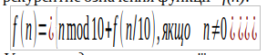
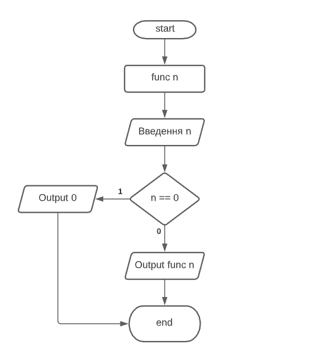
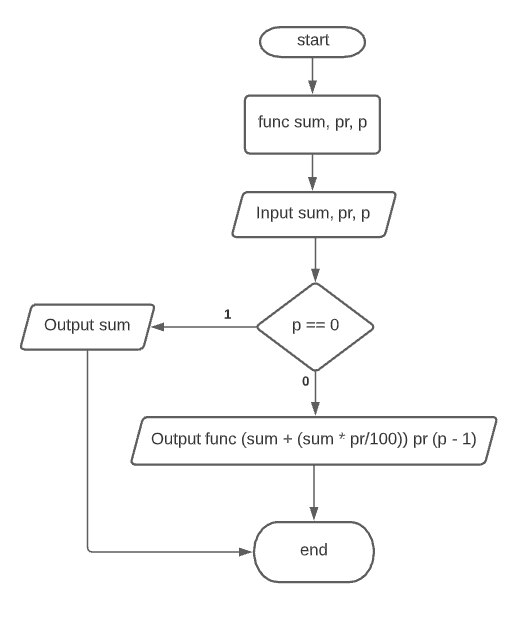
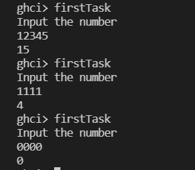
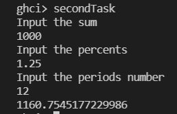

# Лабораторна робота 1

Тема: Використання рекурсії для організації повторювальних процесів. 

**Варіант 1**

## Мета

Сформувати декларативне мислення в галузі програмування завдяки використанню чистих функцій, рекурсій замість циклів, запобіганню даних, що змінюються. Опанувати застосування рекурсивних функцій для обчислювальних процесів.

## Умова задачі

### Задача 1
Ввести з клавіатури натуральне число   n. Знайти суму його цифр, використовуючи рекурентне означення функції   f(n):



Умова продовження рекурсії:   сума цифр числа дорівнює останній цифрі плюс сума цифр числа без останньої цифри (числа, що ділиться без остачі на 10).
Умова закінчення рекурсії:   якщо число дорівнює 0, то сума його цифр дорівнює 0.

### Задача 2
Вкладник поклав в банк   sum   грошових одиниць під   pr   відсотків за один період. Усі дані вводити з клавіатури. Використовуючи рекурсію, визначити величину вкладу по звершенні   m   періодів часу. 
Контрольний тест: введені дані: сума вкладу 1000, відсотки за період 1.25, кількість періодів 12, отриманий результат: 1160.75

## Структура програми

### Блок-схема до задачі 1


### Блок-схема до задачі 2


## Обгрунтування вибору середовища та мови програмування

Середовище програмування: ***VS Code***

Обгрунтування:

- Легкий та зручний редактор коду, який можна використовувати майже для будь-якої мови програмування.
- Має всі необхідні функції для програмування і працює набагато швидше в порівнянні з іншими IDE.

Мова функціонального програмування: ***Haskell***

Обгрунтування:

- Це одна з самих популярних функціональних мов програмування.
- Зручна та обширна документація.
- Звичний синтаксис.

## Код програми

### Задача 1
```
import Data.List
import System.IO
import Distribution.Compat.CharParsing (integral)

func :: Integral p => p -> p
func 0 = 0
func n = (n `mod` 10) + func (n `div` 10)

firstTask = do
    putStrLn "Input the number"
    input <- getLine
    let a = read input :: Integer
    print (func a)
```

### Задача 2
```
import Data.List
import System.IO
import Distribution.Compat.CharParsing (integral)

deposit :: (Eq t1, Num t1, Fractional t2) => t2 -> t2 -> t1 -> t2
deposit sum _ 0 = sum
deposit sum percents periods = deposit (sum + (sum * percents/100)) percents (periods - 1)

secondTask = do
    putStrLn "Input the sum"
    inputSum <- getLine
    let sum = read inputSum :: Double

    putStrLn "Input the percents"
    inputPercents <- getLine
    let percents = read inputPercents :: Double
    
    putStrLn "Input the periods number"
    inputPeriods <- getLine
    let periods = read inputPeriods :: Integer

    print (deposit sum percents periods)
```

## Результати виконання

### Задача 1


### Задача 2


## Висновки
У ході виконання лабораторної роботи було засвоєно використання рекурсії у написанні декларативного коду для виконання обчислень.

У рамках першої задачі було написано програму, що знаходить суму цифр введеного числа за допомогою рекурсивного процесу, а саме звичайної рекурсії.

У рамках другої задачі було написано програму, що визначає величину депозиту по завершенню заданих користувачем періодів. Для вирішення цієї задачі застосована хвостова рекурсія.
