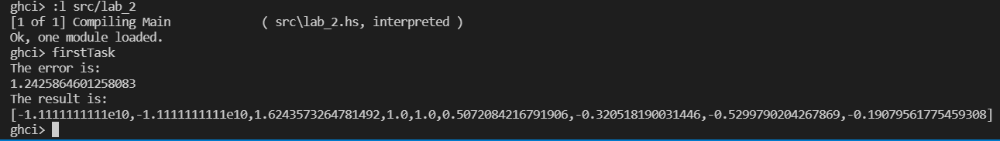
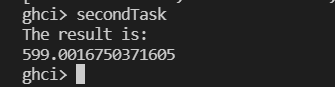

# Лабораторна робота 2

Тема: Рекурентні співвідношення для тригонометричних, експоненціальних функцій та ланцюгові дроби. 

**Варіант 1**

## Мета

Опанувати теоретичні основи застосування рекурентних співвідношень для обчислення тригонометричних, експоненціальних, степеневих функцій та розробити програми функціональними мовам програмування для обчислення їх значень.

## Умова задачі

### Задача 1
Обчислити значення функції у, розвинувши функцію cos(x) у ряд Тейлора. Аргумент х змінюється від -2 до 2 з кроком 0.5. Визначити похибку.


### Задача 2
Обчислити нескінчений ланцюговий дріб, задавши значення n при виклику функції


## Аналіз задачі та математичні забезпечення для розв’язання

Формула, що виражає член послідовності через один або декілька попередніх, називається рекурентним співвідношенням. Послідовність, члени якої задовольняють деякому рекурентному співвідношенню, називається рекурентною.

У загальному випадку рекурентне співвідношення визначає залежність члена послідовності `{Sn}` від `k` попередніх членів: `Sn = F(Sn-k,…,Sn-1)`.

У задачі необхідно розвинути тригонометричну функцію `cos` у ряд Маклорена (Тейлора) за наступною формулою `1 – x^2/2! + x^4/4! – x^6/6! + …`.

## Обгрунтування вибору середовища та мови програмування

Середовище програмування: ***VS Code***

Обгрунтування:

- Легкий та зручний редактор коду, який можна використовувати майже для будь-якої мови програмування.
- Має всі необхідні функції для програмування і працює набагато швидше в порівнянні з іншими IDE.

Мова функціонального програмування: ***Haskell***

Обгрунтування:

- Це одна з самих популярних функціональних мов програмування.
- Зручна та обширна документація.
- Звичний синтаксис.

## Код програми

### Задача 1
```
factorial :: Double -> Double
factorial 0 = 1
factorial n = n * factorial (n - 1)

uCos :: Double -> Double -> Double -> Double
uCos x n precision =
    if (x ** n) / factorial n > precision then (x ** n) / factorial n - uCos x (n + 2) precision
    else 0

y x
  | x >= -1 && x <= 0 = uCos (x / 2) 0 0.0001 / uCos (x ** 2) 0 0.0001
  | x > 0 = (uCos (x / 2) 0 0.0001 ** 2) * uCos (2 * x) 0 0.0001
  | otherwise = -11111111111

firstTask = do 
    putStrLn "The error is:"
    let custom = uCos 5 1 0.00000000001
    let buildin = cos 5
    print (abs (custom - buildin))

    putStrLn "The result is:"
    print (map y [-2, -1.5 .. 2])

```

### Задача 2
```
fraction :: Double -> Double
fraction 0 = 1
fraction n = (2*n - 1) + (1 / fraction  (n - 1))

secondTask = do
  putStrLn "The result is:"
  print (fraction 300)

```

## Результати виконання

### Задача 1


### Задача 2


## Висновки
У ході виконання лабораторної роботи було опановано теоретичні основи застосування рекурентних співвідношень для обчислення тригонометричних, експоненціальних, степеневих функцій та розроблено програми для обчислення їх значень.

У рамках першої задачі було написано програму, що обчислює значення функції, розвинувши функцію cos(x) у ряд Тейлора. Аргумент х змінюється від -2 до 2 з кроком 0.5. Визначено похибку як модуль різниці між значеннням користувацької та встроєної функцій.

У рамках другої задачі було написано програму, що обчислює нескінчений ланцюговий дріб, задавши значення n при виклику функції.
