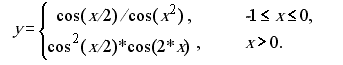

# Лабораторна робота 3

Тема: Форми lambda та let, вираз присвоєння set! для розв’язання нелінійних рівнянь та чисельного інтегрування функцій 

**Варіант 1**

## Мета

Розв’язати нелінійні рівняння та здійснити чисельне інтегрування функцій наближеними методами, використовуючи мови функціонального програмування та lambda, let та set! форми.

## Умова задачі

### Задача 1
Розв’язати нелінійне рівняння `x = cos(x)` методами перебору та хорд, визначивши інтервал `[a, b]`, на якому існує рішення рівняння. Значення `a`, `b` інтервалу вибрати самостійно. Порівняти результати розв’язків двома методами. 

### Задача 2
За допомогою формули Сімпсона інтеграл функції f(х) від a до b наближено обчислюється у вигляді:



де `h = (b - a) / n`, для якогось парного цілого числа `n`, `yk = f (a + kh)`. (Збільшення n підвищує точність наближеного обчислення.) Визначити процедуру, яка приймає в якості аргументів  f, a, b, n, та повертає значення інтеграла, обчисленого за формулою Сімпсона.

## Аналіз задачі та математичні забезпечення для розв’язання


## Обгрунтування вибору середовища та мови програмування

Середовище програмування: ***VS Code***

Обгрунтування:

- Легкий та зручний редактор коду, який можна використовувати майже для будь-якої мови програмування.
- Має всі необхідні функції для програмування і працює набагато швидше в порівнянні з іншими IDE.

Мова функціонального програмування: ***Haskell***

Обгрунтування:

- Це одна з самих популярних функціональних мов програмування.
- Зручна та обширна документація.
- Звичний синтаксис.

## Код програми

### Задача 1
```
chordMethod :: (Ord t, Fractional t) => t -> (t -> t) -> t -> t -> t
chordMethod eps f a b
    | abs (f x) <= eps = x
    | f a * f x < 0 = chordMethod eps f a x
    | otherwise = chordMethod eps f x b
    where x = a + abs (f a / (f b - f a)) * (b - a)
    
iterationMethod :: (Num a1, Num a2, Ord a1, Ord a2) => a2 -> (a2 -> a2) -> (t -> a1) -> a2 -> t -> t -> a2
iterationMethod eps f df x0 a b
    | df a >= df b || df b >= 1 = -1
    | abs (x1 - x0) >= eps = iterationMethod eps f df x1 a b
    | otherwise = x1
    where x1 = f x0

firstTask = do
    let f1 = \x -> cos x
    let df1 = \ x -> sin x

    print (iterationMethod 0.000001 f1 df1 0.5 0 1.5)

    let f2 = \x -> x - cos x
    print (chordMethod 0.000001 f2 0 1.5)

```

### Задача 2
```
data Interval = I (Double,Double) Int
toXs :: Interval -> [Double]
toXs (I (a, b) n) = map (\x -> a + (b-a) / fromIntegral (n-1) * fromIntegral x) [0..n-1] -- make array from interval

wSimp h n number | (number == 1 || number == n) = (1/3) * h -- compute coefficients
                 | (number > 1 && number < n && even number) = (4/3) * h
                 | (number > 1 && number < n && odd number) = (2/3) * h
                 | otherwise = error "error"

integralSimp f (I (a,b) n) = 
    let h = (b - a) / fromIntegral (n - 1)
        xs = toXs (I (a, b) n)
        fs = map f xs
        ws = map (wSimp h n) [1..n]
    in sum $ zipWith (*) fs ws

secondTask = do
    let f = \x -> cos x / sqrt (1 - x ** 2)
    
    print (integralSimp f (I (0, pi/4) 100))

```

## Результати виконання


## Висновки

У ході виконання цієї лабораторної роботи було опановано основні методи чисельного інтергрування та розв'язання нелінійних рівнянь з використанням функціональної парадигми програмування, зокрема з використанням лямбда-функцій та let/where форм.
У першій задачі написано програму для розвязання нелінійних рівнянь методами перебору та хорд, порівняно результати їх роботи.
У другій задачі написано програму для чисельного інтегрування функцій за формулою Сімпсона.