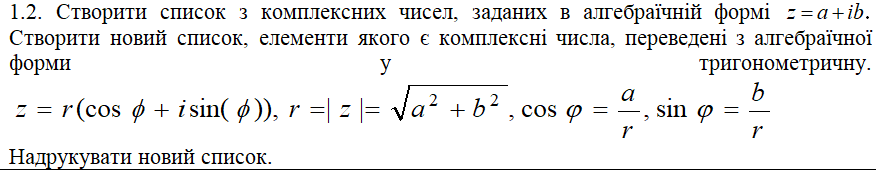
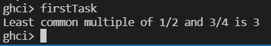
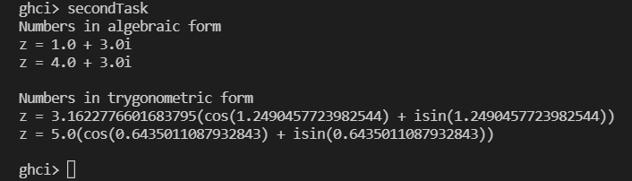

# Лабораторна робота 5

Тема: Обробка раціональних та комплексних чисел мовами функціонального програмування

**Варіант 1**

## Мета

Опанувати технологію абстракції даних в мовах функціонального програмування. Реалізувати програму обробки раціональних та комплексних чисел мовами функціонального програмування, представивши ці числа конструкціями типу «пара».

## Умова задачі

### Задача 1
Задати декілька (два) раціональних (дробових) чисел і знайти їх найменше спільне кратне (НСК). Для цього знайти НСК чисельників цих дробив і поділити на найбільший спільний дільник (НСД) знаменників цих дробив. 
НСК(a/b,c/d)=НСК(ad/bd,bc/bd)=НСК(НСК(ad,bc)/bd)=НСК(ad,bc)/НСД(bd,НСК(ad,bc)) 

### Задача 2


## Обгрунтування вибору середовища та мови програмування

Середовище програмування: ***VS Code***

Обгрунтування:

- Легкий та зручний редактор коду, який можна використовувати майже для будь-якої мови програмування.
- Має всі необхідні функції для програмування і працює набагато швидше в порівнянні з іншими IDE.

Мова функціонального програмування: ***Haskell***

Обгрунтування:

- Це одна з самих популярних функціональних мов програмування.
- Зручна та обширна документація.
- Звичний синтаксис.

## Код програми

### Задача 1
```
asRational rat = show (fst rat) ++ "/" ++ show (snd rat)

ratLcm rat1 rat2 = z `div` gcd (b*d) z
  where a = fst rat1
        b = snd rat1
        d = snd rat2
        z = lcm (a*d) (b * fst rat2) 

firstTask = do
  let fRat = (1, 2)
  let sRat = (3, 4)
  let res = "Least common multiple of " ++ asRational fRat ++ " and " ++ asRational sRat ++ " is " ++ show (ratLcm fRat sRat)
  putStrLn res
```

### Задача 2
```
getR com = sqrt (fst com ** 2 + snd com ** 2)
getPhi com = acos (fst com / getR com)
asTrygonometric com = "z = " ++ show (getR com) ++ "(cos(" ++ phi ++ ") + isin(" ++ phi ++ "))"
  where phi = show (getPhi com)
asAgebraic :: (Show a1, Show a2) => (a1, a2) -> String 
asAgebraic com = "z = " ++ show (fst com) ++ " + " ++ show (snd com) ++ "i"


secondTask = do
  let complex = [(1, 3), (4, 3)]
  putStrLn "Numbers in algebraic form"
  putStrLn (unlines [asAgebraic x | x <- complex])

  putStrLn "Numbers in trygonometric form"
  putStrLn (unlines [asTrygonometric x | x <- complex])
```

## Результати виконання




## Висновки

У ході виконання цієї лабораторної роботи опанувано технологію абстракції даних в мовах функціонального програмування. Реалізувано програму обробки раціональних та комплексних чисел мовами функціонального програмування, представивши ці числа конструкціями типу «пара».
У першому завданні написано програму, що знаходить найменше спільне кратне для двох раціональних чисел.
У другому завданні реалізовано програму, яка представляє комплексні числа, задані типом "пара" у алгебраічній та тригонометричній формі.