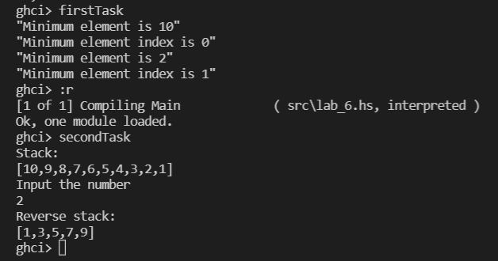

# Лабораторна робота 5

Тема: Обробка структур типу векторів і матриць, стеків та черг мовами функціонального програмування


**Варіант 1**

## Мета

Опанувати теоретичні основи обробки структур типу векторів і матриць, стеків та черг мовами функціонального програмування та розробити програми їх реалізації.

## Умова задачі

### Задача 1
Створити вектор. Визначити максимальне та мінімальне значення серед елементів із парними та непарними індексами. Вивести мінімальний, максимальний елементи та їх індекси.

### Задача 2
Побудувати стек натуральних чисел. Вивести на екран створений стек. Надрукувати в зворотному порядку числа стеку, пропускаючи кратні заданому користувачем числу.

## Обгрунтування вибору середовища та мови програмування

Середовище програмування: ***VS Code***

Обгрунтування:

- Легкий та зручний редактор коду, який можна використовувати майже для будь-якої мови програмування.
- Має всі необхідні функції для програмування і працює набагато швидше в порівнянні з іншими IDE.

Мова функціонального програмування: ***Haskell***

Обгрунтування:

- Це одна з самих популярних функціональних мов програмування.
- Зручна та обширна документація.
- Звичний синтаксис.

## Код програми

### Задача 1
```
filterIndex :: Eq b => [b] -> ([b] -> b) -> Int
filterIndex xs predicate = head $ filter ((== predicate xs) . (xs !!)) [0..]

firstTask = do
  let v = [10, 2, 4, 5, 9]

  print ("Maximum element is " ++ show (maximum v))
  print ("Maximum element index is " ++ show (filterIndex v maximum))

  print ("Minimum element is " ++ show (minimum v))
  print ("Minimum element index is " ++ show (filterIndex v minimum))
```

### Задача 2
```showReverse :: Integral a => [a] -> a -> [a]
showReverse stack m = filter (\x -> x `mod` m /= 0) (reverse stack)

secondTask = do
  let stack = [10, 9 .. 1]
  putStrLn "Stack:"
  print stack

  putStrLn "Input the number"
  input <- getLine
  let m = read input :: Int

  putStrLn "Reverse stack:"
  print (showReverse stack m)
```

## Результати виконання



## Аналіз достовірності результатів

У першому завданні серед елементів вектору `[10, 2, 4, 5, 9]` мінімальним елементом є 2 з індексом 1, максимальним елементом є 10 з індексом 0.

У другому завданні стек `[10, 9, 8, 7, 6, 5, 4, 3, 2, 1]` виведено у зворотньому порядку, виведені лише ті елементи, які не кратні введеному числу 2.

## Висновки

У ході виконання цієї лабораторної роботи опановано теоретичні основи обробки структур типу векторів і матриць, стеків та черг мовами функціонального програмування та розробити програми їх реалізації.