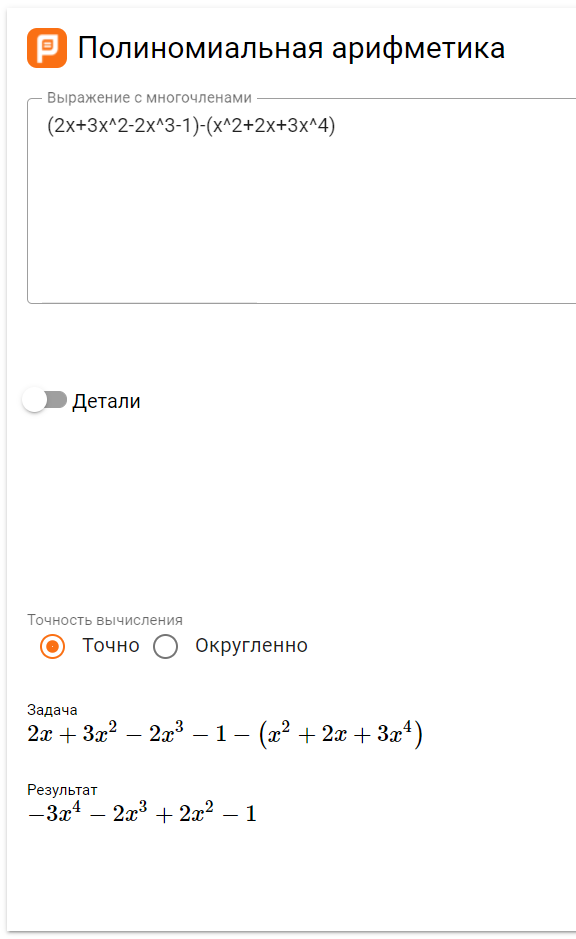

# Лабораторна робота 8

Тема: Символьні обчислення мовами функціонального програмування. Операції з многочленами. 

**Варіант 1**

## Мета

Опанувати теоретичні основи символьних обчислень мовами функціонального програмування. Розробити програми символьного диференціювання та реалізації арифметики поліномів

## Умова задачі


## Обгрунтування вибору середовища та мови програмування

Середовище програмування: ***VS Code***

Обгрунтування:

- Легкий та зручний редактор коду, який можна використовувати майже для будь-якої мови програмування.
- Має всі необхідні функції для програмування і працює набагато швидше в порівнянні з іншими IDE.

Мова функціонального програмування: ***Haskell***

Обгрунтування:

- Це одна з самих популярних функціональних мов програмування.
- Зручна та обширна документація.
- Звичний синтаксис.

## Код програми

```import Data.List ( groupBy, intercalate, sortBy )

showTerm :: (Ord a, Num a, Num b, Show a, Show b, Eq b) => (a, b) -> [Char] -> [Char]
showTerm term var = (if fst term < 0 then "(" else "")
  ++ (if fst term == -1 then "-" else "")
  ++ (if fst term > 1 || fst term < -1 then show (fst term) else "")
  ++ var
  ++ (if snd term /= 1 then "^" ++ show (snd term) else "")
  ++ (if fst term < 0 then ")" else "")

showZeroTerm :: (Ord a, Num a, Show a) => (a, b) -> [Char]
showZeroTerm term = (if fst term < 0 then "(" else "") ++ show (fst term) ++ (if fst term < 0 then ")" else "")

showPoly :: (Ord a, Num b, Num a, Show a, Show b, Eq b) => [(a, b)] -> [Char] -> [Char]
showPoly poly var = intercalate " + " [ if snd x == 0 then showZeroTerm x else showTerm x var | x <- poly ]

sortPolyDegree :: Ord a1 => (a2, a1) -> (a3, a1) -> Ordering
sortPolyDegree (a1, b1) (a2, b2) = if b1 > b2 then LT else GT

groupPolyDegree :: Eq a1 => (a2, a1) -> (a3, a1) -> Bool
groupPolyDegree (a1, b1) (a2, b2) = b1 == b2

dropZeroCoeff :: (Eq a, Num a) => (a, b) -> Bool
dropZeroCoeff (x1, x2) = x1 /= 0

foldPolyCoeff :: Num a => a -> (a, b) -> a
foldPolyCoeff y (x1, x2) = y + x1

simplifyPoly :: (Num a, Eq a, Ord b) => [(a, b)] -> [(a, b)]
simplifyPoly poly = filter dropZeroCoeff [ (foldl foldPolyCoeff 0 x, snd (head x)) | x <- groupBy groupPolyDegree (sortBy sortPolyDegree poly)]

addPoly :: (Num a, Ord b, Eq a) => [(a, b)] -> [(a, b)] -> [(a, b)]
addPoly a b = simplifyPoly (a ++ b)

subtractPoly :: (Num a, Ord b, Eq a) => [(a, b)] -> [(a, b)] -> [(a, b)]
subtractPoly a b = simplifyPoly (a ++ [(-(fst x), snd x) | x <- b])

timesPoly :: (Ord b, Foldable t, Num a, Num b, Eq a) => t (a, b) -> [(a, b)] -> [(a, b)]
timesPoly a b = simplifyPoly (foldl (\acc (a1, a2) -> acc ++ map (\(b1, b2) -> (a1*b1, a2 + b2)) b) [] a)

make = do
  let a = [(2, 1), (3, 2), (-2, 3), (-1, 0)]
  let b = [(1, 2), (2, 1), (3, 4)]

  putStr "First polynome: "
  print (showPoly a "x")
  putStr "Second polynome: "
  print (showPoly b "x")

  putStrLn ("(" ++ showPoly a "x" ++ ") + (" ++ showPoly b "x" ++ ") = " ++ showPoly (addPoly a b) "x")
  putStrLn ("(" ++ showPoly a "x" ++ ") - (" ++ showPoly b "x" ++ ") = " ++ showPoly (subtractPoly a b) "x")
  putStrLn ("(" ++ showPoly a "x" ++ ") * (" ++ showPoly b "x" ++ ") = " ++ showPoly (timesPoly a b) "x")
```

## Результати виконання


## Аналіз достовірності результатів





## Висновки

У ході виконання цієї лабораторної роботи було опанувано теоретичні основи символьних обчислень мовами функціонального програмування. Розробити програми символьного диференціювання та реалізації арифметики поліномів